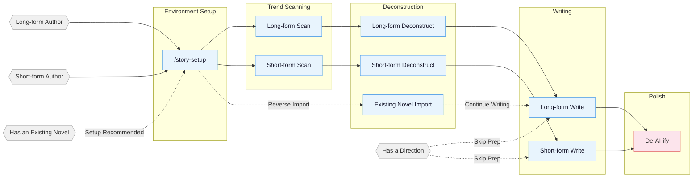

<!-- Last synced with README.md: 2026-08-30 -->

**English** | [中文](README.md)

# oh-story-claudecode

A web-novel writing skill pack covering the full pipeline for long-form and short-form Chinese web novels: trend scanning, deconstruction, writing, AI-tone removal, and cover generation. Ships with built-in adapters for Claude Code, Google Antigravity, OpenCode, ZCode, OpenClaw, Codex CLI, and Reasonix. Any Web AI / agent environment that can read project files can also use the generic skills path.

## Core Approach

> **Tropes = deterministic emotional payoff**

Professional authors follow a three-step method:

1. **Scan the charts** — analyze trending lists, identify genres, character setups, and entry points.
2. **Deconstruct** — break down outline pacing and plot materials, build a personal module library.
3. **Commercialize the writing** — learn and apply core techniques like hooks, payoff density, and expectation management.

Built around four pillars: reverse-engineering hits · plot modularization · layered state management · human–AI collaboration.

> **Antigravity support preview:** `story-setup` can deploy all 13 skills, 7 custom agents, an Always-On Rule, and workspace hooks into the project's `.agents/` tree. The deployer does not modify `~/.gemini/`, does not depend on global directories, and does not require symlink discovery. In `.agents/hooks.json` it replaces only the top-level `oh-story` management group and preserves user groups. This contract keeps `agents_version: 29`; open a fresh Antigravity conversation after deployment and smoke-test both the IDE and interactive `agy` separately.

> **v0.7.9 — Short-form calibrated by scene function:** the short-form skill drops per-section word floors, the 3-5 sub-event rule, dialogue ratios, and fixed hook intervals in favor of a single readable test — does this scene change risk, information, relationships, resources, a decision, an action, or the reader's understanding? The teaser is now the first scene of the prose, and chapter 1 continues from its consequences or a new action rather than replaying it. Adds a structural verifier for chapter outlines; the outline's target-emotion and protagonist-choice fields no longer accept placeholders. After upgrading, rerun `/story-setup` and start a new session; this release's `agents_version` is 29. [Full changes](CHANGELOG.md#079---2026-08-30)
>
> **v0.7.8 — Reference split and gates:** long-form and short-form reference materials are split per consumer and renamed; a blocking Reference Gate now runs before writing prose or designing a short story, and Phase 2 plus final delivery each gain a deterministic verifier. Short-form word count now follows the user-specified range. After upgrading, rerun `/story-setup` and start a new session; `agents_version` is 28. [Full changes](CHANGELOG.md#078---2026-08-28)
>
> **v0.7.7 — Memory and tightening:** long-form prose now uses a single machine-enforced word-count metric; under-length chapters are not padded with new plot, and over-length chapters get at most one compression pass. Adds cross-session author memory and Codex built-in ImageGen, and fixes recursive story-setup copies. A missing or invalid "word target" now halts the run instead of falling back to 3,000. After upgrading, rerun `/story-setup` and start a new session; `agents_version` is 26. [Full changes](CHANGELOG.md#077---2026-08-26)
>
> For earlier versions, see [CHANGELOG.md](CHANGELOG.md).

## Pipeline Overview



## Installation

**Option 1** — tell Claude Code / Antigravity / OpenCode / ZCode / OpenClaw / Codex / Reasonix, or any other Web AI / agent platform that can import a GitHub repo or skill:

```
Install this skill https://github.com/zenstory-ai/oh-story-claudecode
```

To upgrade, repeat the same instruction.

**Option 2** — command line:

```bash
npx skills add zenstory-ai/oh-story-claudecode -y -g
```

`-g` installs globally (available in every directory); drop `-g` to install into the current directory only. Re-run the same command to update.

On Windows you may occasionally see an `ENOENT ... mkdir` error even though the run still ends with `Done!`. That means a skill was only partially installed. If a whole subdirectory of story-setup's reference bundle is missing, `/story-setup` reports an incomplete reference bundle; other forms of partial install may not be reported. Either way, re-run the same install command to fix it.

<details>
<summary>Antigravity / Codex / ZCode / OpenCode / OpenClaw / Reasonix / Web AI usage notes</summary>

**Antigravity users:** Run `/skills` (or use natural language) to invoke `story-setup` and select `target_cli=antigravity`. Inside the current writing project it will create or update 13 known `.agents/skills/` directories, 7 known `.agents/agents/agent-name/agent.md` definitions (where `agent-name` is the actual name), `.agents/rules/oh-story.md`, two `.agents/hooks/` runtime files, and the `oh-story` management group in `.agents/hooks.json`. Other user Skills, Agents, Rules, Hooks, and hook groups are preserved; the deployer itself never writes `~/.gemini/`. Skills are real project-local directories. If `.agents/skills` is already a symlink, the setup will explain the git-diff impact and ask for explicit migration approval; without approval it will never write through the link. Hooks require `node` on PATH. Open a fresh conversation after deployment, then smoke-test both the IDE and interactive `agy` separately. **`agy 1.1.22 -p` is currently outside the supported surface:** each headless process may scan the workspace before silent authentication finishes, then fail to reload custom agents and hooks after authentication, which can lead to skill fallback, `subagent not found`, or ordinary model output being written to `~/.gemini/antigravity-cli/scratch/`. For CLI writing, start interactive `agy` from the project directory, confirm `/skills`, `/agents`, and `/hooks` have discovered oh-story before sending tasks, and check the scratch directory for accidental novel output after testing.

**Codex users:** Use it in-place: Codex scans `$REPO_ROOT/.agents/skills` (a symlink pointing to `skills/`) and discovers all 13 skills; invoke via `$story`, `$story-setup`, or `/skills`. On Windows, git must have `core.symlinks=true` or the symlink will not work, in which case fall back to the `$story-setup` deployment below.

After running `$story-setup` to deploy into a writing project, it writes `.codex/agents/*.toml`, `.codex/hooks.json`, `.codex/hooks/{story_codex_hook.py,run-story-hook.sh,run-story-hook.cmd}`, and `.codex/skills/story-setup/references/agent-references/`; please trust the project `.codex/` config layer, review/trust hooks in `/hooks`, and open a fresh Codex session so custom agents take effect.

**ZCode users:** Add this repository as a marketplace in Plugin Management, install `oh-story`, then invoke the 13 Skills/Commands via `$story`, `$story-setup`, or the `/` panel. With `target_cli=zcode`, `$story-setup` deploys `.zcode/skills/`, `.zcode/commands/`, and `.zcode/hooks/story_zcode_hook.js`, and safely merges `.zcode/config.json` and the root `AGENTS.md`. Hooks require `node` on PATH. ZCode 3.3.4 does not execute project/plugin custom agents and has no `PreCompact` / `SessionEnd`; affected workflows explicitly fall back to solo/direct, and `SessionStart` restores context after compaction.

**OpenCode users:** After global install, opencode auto-discovers skills from `~/.claude/skills/`; trigger story-setup with natural language on first use (e.g., "use story-setup to deploy the web-novel writing environment"), then **exit and re-enter with `opencode -c`** before slash commands will work. Some hook behavior differs from Claude Code (session-start / session-end / compact, etc.) — see the OpenCode section in [CONTRIBUTING.md](CONTRIBUTING.md).

**OpenClaw users:** Currently skills-only. OpenClaw can discover the 13 skills from workspace `skills/`, `.agents/skills`, `~/.agents/skills`, `~/.openclaw/skills`, or configured extra skill roots. `SKILL.md` files use the OpenClaw-required single-line `name` / `description` and single-line JSON `metadata.openclaw`. When `story-setup` targets OpenClaw, it copies skills into the project's `skills/` and writes an OpenClaw-formatted `AGENTS.md`; agents/hooks are not deployed, so the outline-before-prose guard is enforced as a soft skill check rather than a runtime hook. If new skills do not appear after deployment, open a fresh OpenClaw session or wait for the skills watcher to refresh.

**Reasonix users:** Currently skills + native plugin manifest. Reasonix natively scans project skill roots (`.agents/skills`, etc. — a symlink to `skills/`) and discovers all 13 skills; verify with `reasonix doctor capabilities`. You can also use the root `reasonix-plugin.json` via `reasonix plugin install`. When `story-setup` targets `target_cli=reasonix`, it copies skills into the project's `skills/` and writes a Reasonix-formatted `AGENTS.md`; hooks/custom agents are not deployed, so skills that need specialist agents fall back to solo/direct. If Windows symlinks are disabled, use the native plugin instead.

**Generic Web AI / agent users:** If your platform can read a GitHub repo or project files, have the agent read `skills/*/SKILL.md` plus the relevant `references/`. For local copies, `story-setup` supports `target_cli=generic` which only writes a generic `AGENTS.md` and `skills/`. In environments without this project's hooks/custom agents, checks run as skill-level soft constraints or solo/direct fallbacks.

**Manual cleanup needed on the OpenClaw / Reasonix / generic paths:** these three keep their skill copy inside the project's `skills/`, so re-running `/story-setup` executes that project-local copy and the auto-cleanup cannot reach it. If you find `skills/story-setup/references/agent-references/agent-references/` (possibly nested several levels deep) or `skills/story-setup/skills/` in your project, delete them by hand. To update the skill text itself, reinstall this project and overwrite the 13 skill directories under the project's `skills/` from the new package.

</details>

After upgrading, if you have already run `/story-setup` in a project, re-run `/story-setup` from the project root to sync hooks / agents / references. Per-version changes are listed in [CHANGELOG.md](CHANGELOG.md) and [Releases](https://github.com/zenstory-ai/oh-story-claudecode/releases).

**Multi-agent collaboration requires setup + a fresh session:** the 7 specialist agents (story-architect, narrative-writer, consistency-checker, etc.) are written to `.claude/agents/` by `/story-setup`, to `.codex/agents/*.toml` by `$story-setup`, or generated as `.agents/agents/agent-name/agent.md` (where `agent-name` is the actual name) by Antigravity `story-setup`. Antigravity calls them with `invoke_subagent` + a matching `TypeName`; if custom subagents are not exposed at runtime, each skill explicitly reports a solo/direct fallback. How to check: in a fresh session, run `/story-review`; a report header of `Effective Mode: full/lean` means the agents are registered; `Fallback: ... -> solo` means the current runtime does not expose the agent.

**Import + continuation order:** the recommended path is to first run `/story-setup` at the writing project root (to deploy hooks/agents/AGENTS), open or refresh the session, then run `/story-import` to import the existing novel, and continue with `/story-long-write 日更` or `/story-long-write 写第N章`. You can also run `/story-import` directly; it will first detect whether setup has been run, and if not, offer to either run setup first or continue with a serial import.

**Author habits persist across sessions:** tell `/story` "remember my writing habit" — confirmed stable preferences will be written to the workspace's `.story/作者记忆/`; an `Author Memory Receipt` is the only signal that the write succeeded. Normal writing only queries relevant confirmed items with a hard 2 KB output cap, never injecting the full profile, candidates, or history into the prose prompt. This memory is separate from per-book continuity tracking; current requirements, book settings, and hard gates always take priority.

## Skills

|| Skill | Trigger | Description |
||:------|:--------|:------------|
|| `story-setup` | `/story-setup` / `$story-setup` | Environment setup — Claude/Antigravity/OpenCode/Codex/ZCode/OpenClaw/Reasonix + generic (safe merge with existing config) |
|| `story` | `/story` / `$story` / `/story dashboard` | Toolbox router — fuzzy-intent dispatch + author-habit management + local deconstruction/project dashboard |
|| `story-long-write` | `/story-long-write` | Long-form writing — outline building, character design, prose output |
|| `story-long-analyze` | `/story-long-analyze` | Long-form deconstruction — Golden First 3 Chapters, payoff design, pacing analysis |
|| `story-long-scan` | `/story-long-scan` | Long-form trend scan — Qidian/Fanqie/Jinjiang market trends |
|| `story-short-write` | `/story-short-write` | Short-form writing — emotion design, twist crafting, polish & delivery |
|| `story-short-analyze` | `/story-short-analyze` | Short-form deconstruction — story core, structure, emotional line, reversal design, writing techniques, resonance analysis |
|| `story-short-scan` | `/story-short-scan` | Short-form trend scan — Zhihu Yanyan/Fanqie short-form trending data |
|| `story-deslop` | `/story-deslop` | De-AI-ify — detect and remove AI writing traces |
|| `story-import` | `/story-import` | Reverse import — parse existing novels back into the standard project structure |
|| `story-review` | `/story-review` | Multi-perspective review — 4-agent adversarial review + Fanqie/Qidian/Zhihu scoring rubrics |
|| `story-cover` | `/story-cover` | Cover generation — title/genre analysis + GPT-Image-2 via Codex built-in usage or API fallback |
|| `browser-cdp` | `/browser-cdp` | Browser control — CDP protocol to reuse login sessions and scrape data |

> `story-deslop` uses local prose linting: blocking is limited to deterministic style/punctuation issues; other findings are read-through judgments. External detectors like Zhuque are only self-test references and do not replace human read-through.

Natural language also triggers:
- "Help me start a book" → `story-long-write`
- "This is too AI-ish" → `story-deslop`
- "Import my book" → `story-import`
- "Open the workbench" → `story dashboard` (browse the local deconstruction library and writing project, with light editing)
- "Remember my writing habit" → `story` author memory (original-quote evidence, pending items, conflict replacement)
- "What is Shen Zhi's current state" → auto-spawn `story-explorer` agent

### Story Dashboard

Run `/story dashboard` (or `$story dashboard` in Codex) to open the local writing workbench — browse the deconstruction library and long/short project file trees, then search, preview Markdown, edit text, save with conflict protection, and confirm file deletions. The server listens only on `127.0.0.1`; novel content is never uploaded.


<details>
<summary>Cover generation example</summary>


</details>

<details>
<summary>Deconstruction demo — Coiling Dragon</summary>

Full output of `/story-long-analyze` in deep mode on the first 23 chapters of 《盘龙》:

```
demo/拆文库/盘龙/
├── 概要.md              # Whole-book overview + chapter index
├── 拆文报告.md           # Five-dimension scoring + payoff density + reusable tropes
├── 文风.md              # Sentence length / punctuation / dialogue subtext / emotion pacing + source anchors
├── 章节/
│   ├── 第1章_深度拆解.md … 第3章_深度拆解.md  # One deep analysis per Golden-3 chapter
│   └── 第1章_摘要.md … 第23章_摘要.md          # One summary file per chapter
├── 角色/
│   ├── 林雷.md           # Protagonist full profile
│   ├── 霍格.md           # Core supporting
│   ├── 希尔曼.md         # Core supporting
│   ├── 希里.md           # Functional character
│   ├── 德林柯沃特.md      # Core supporting
│   ├── 沃顿.md           # Functional character
│   └── 角色关系.md        # Relationship network
├── 剧情/
│   ├── 故事线.md          # Framework identification + 4 plot lines + 2 story lines
│   ├── 强者过境与魔法启蒙.md etc.  # Five scene-level plot units
│   ├── 节奏.md            # Pacing / key-info progression / emotional trigger eruption rhythm
│   └── 情绪模块.md        # Reader needs / emotion engine / reusable writing modules
└── 设定/
    ├── 世界观/
    │   ├── 背景设定.md    # Core rules + special settings
    │   ├── 力量体系.md    # Battle qi + magic + ranks
    │   ├── 地理.md        # Andalusia + Yulan Continent
    │   └── 金手指.md      # Panlong Ring + Delin Cowort
    └── 势力/
        └── 巴鲁克家族.md  # Baruch dragon-blood family archive
```

Long-form deconstruction additionally produces `文风.md`, and under `剧情/` produces `节奏.md` (pacing / key-info progression / emotional trigger eruption rhythm) and `情绪模块.md` (reader needs / emotion engine / reusable writing modules); daily writing reads these through `对标/{书名}/剧情/` to avoid drifting from the benchmark book's voice, pacing, and emotion modules.

</details>

<details>
<summary>Deconstruction demo — Once I Hid My Love (short story)</summary>

Full output of `/story-short-analyze` deconstructing the short story 《曾将爱意私藏》 (~8,500 chars, win-back / faked-death):

```
demo/拆文库/曾将爱意私藏/
├── 原文/原文.txt        # Source-text backup
├── 拆文报告.md          # Story core + 5-dimension scores + 6-facet payoff + cognitive reversal + 9-layer resonance
├── 情节节点.md          # 54 plot nodes (source quotes + emotion markers −9~+9)
├── 写作手法.md          # POV / dialogue / info-gap / object-hook etc., 11 techniques
└── _meta.json           # structure_counts (Phase 7 gate basis)
```

Short-form deconstruction outputs `拆文报告 / 情节节点 / 写作手法`; the downstream `/story-short-write` uses these to write a new same-genre short story.

</details>

<details>
<summary>Import demo — 让你管账号，你高燃混剪炸全网 (long-form continuation project)</summary>

The recommended flow is to first run `/story-setup` to deploy the writing project, then use `/story-import` to reverse-engineer the author's already-published first 20 chapters (~37k Chinese characters) into a continuation-ready writing project, and finally connect `/story-long-write 日更` or `/story-long-write 写第21章` to continue writing:

```
demo/长篇/让你管账号，你高燃混剪炸全网/
├── 正文/        Chapters 001–020 (already-published source text)
├── 大纲/        大纲.md · 卷纲_第1卷.md · 细纲_第001–020章.md (one file per chapter)
├── 设定/        角色/{江晨·钟嘉嘉·周薄森·张耀祖·吴伟·李林}
│                世界观/{背景设定·金手指} · 关系.md · 题材定位.md · 文风.md
└── 追踪/        _tracking-state.json · 上下文.md · 伏笔.md · 逐章记录/
                 角色状态/{角色名}.md · 时间线/{作者真相.md·读者已知.md}
```

Per-chapter extraction (events / characters / settings / foreshadowing / timeline) is reverse-engineered into a continuation bible, and the author picks up seamlessly from chapter 21.

</details>

## Agent System

The writing skills internally coordinate 7 specialist agents, each with its own role:

|| Agent | Model | Role |
||:------|:------|:-----|
|| **story-architect** | Opus | Story architecture — genre positioning, outline structure, hook/twist design, emotion arcs |
|| **character-designer** | Sonnet | Character design — profiles, voice, motivation chains, dialogue writing |
|| **narrative-writer** | Sonnet | Narrative writer — prose writing, de-AI-ify, format compliance |
|| **consistency-checker** | Haiku | Consistency check — fact conflict scanning, foreshadowing tracking, S1-S4 graded reports |
|| **story-researcher** | Sonnet | Research — CDP search + full-text extraction, multi-source cross-verification, structured reference files |
|| **story-explorer** | Haiku | Story query — read-only character/foreshadowing/setting/progress lookup, fast context loading for daily writing |
|| **chapter-extractor** | Haiku | Chapter extraction — summaries, plot nodes, character mentions, the parallel deconstruction unit |

Agents load writing theory from `references/` on demand (100+ methodology files: character design, dialogue techniques, twist toolbox, etc.) without reserving context window space.

## Automation Hooks

`/story-setup` deploys 8 automation hooks for Claude Code:

|| Hook | Trigger | Function |
||:-----|:---------|:---------|
|| session-start.sh | Session start | Show branch, progress snapshot, deconstruction status |
|| session-end.sh | Session end | Log the session to `追踪/session-log.txt` |
|| detect-story-gaps.sh | Session start | Detect setting gaps, missing outlines, broken foreshadowing |
|| pre-compact.sh | Before context compaction | Save progress-snapshot path and line-count summary |
|| post-compact.sh | After context compaction | Prompt to read the progress snapshot for context recovery |
|| validate-story-commit.sh | git commit | Check hardcoded attributes, setting required fields (warning only, non-blocking) |
|| guard-outline-before-prose.sh | Before writing prose (Write/Edit) | Block first creation of a chapter/story body when its 细纲/小节大纲 is missing (blocking) — enforces outline-first |
|| check-prose-after-write.sh | After writing prose (Write/Edit) | Lightly scan for truncation, leaked workflow terms, deterministic toxic phrasing, and word-count debt (advisory) |

## Project File Structure

A long-form novel easily reaches hundreds of thousands of words across hundreds of chapters. Setting conflicts, broken foreshadowing, timeline inconsistencies — relying on memory alone to hold it all together is a recipe for disaster.

Use the file system to split settings, outlines, prose, and tracking into independent dimensions. The conversation handles creation; the file system handles memory.

Workspace-level author memory is kept separate from any one book:

```text
.story/作者记忆/
├── _author-memory-state.json  # Single structured source of truth
├── 作者画像.md               # Confirmed preferences usable in creation
├── 待确认.md                 # Inferences, repeated corrections, conflict candidates
└── 变更记录.md               # Auditable replacement and withdrawal history
```

**Long-form:**

```
{Book Title}/
├── 设定/
│   ├── 世界观/          # Background, power system, etc. — one file per topic
│   ├── 角色/            # One file per character (江晨.md, 钟嘉嘉.md)
│   ├── 势力/            # One file per faction/organization (火箭军文工团.md)
│   ├── 关系.md          # Character relationship map
│   └── 题材定位.md      # Core trope + benchmark analysis
├── 大纲/
│   ├── 大纲.md          # Full-book volume-level structure
│   ├── 卷纲_第一卷.md   # One per volume: payoff pacing + emotion arc + character arc + foreshadowing + twists
│   ├── 细纲_第001章.md  # One per chapter: summary + multi-line plot + relationship/order + hooks
│   └── ...
├── 正文/
│   ├── 第001章_章名.md
│   └── ...
├── 对标/                # Benchmark reference (structured subdirs synced from deconstruction)
│   └── {Benchmark Book}/
│       ├── 原文/            # Benchmark book original chapters
│       ├── 角色/            # Structured character cards (synced from analyze)
│       ├── 剧情/            # Structured plot lines / pacing / emotion modules (synced from analyze)
│       ├── 设定/            # Structured settings (synced from analyze)
│       ├── 文风.md          # Read before daily writing, used to approximate the benchmark voice
│       └── 拆文报告.md      # Deconstruction report output by the analyze skill
├── 追踪/                # File-first continuity state
│   ├── _tracking-state.json # Single structured source of truth (not loaded into prose prompts)
│   ├── 上下文.md        # Derived continuation state card (fixed 7 sections, ≤12KB)
│   ├── 逐章记录/        # Per-chapter future-relevant continuity records / revision overlays (≤3072 bytes)
│   ├── 角色状态/        # Derived core-character snapshots (江晨.md, 钟嘉嘉.md)
│   ├── 伏笔.md          # Derived current foreshadowing view
│   └── 时间线/          # Derived author-truth.md + reader-known.md
├── 参考资料/            # story-researcher output
│   └── {topic}.md       # Split by research topic
```

**Short-form:**

```
短篇/{Title}/
├── 正文.md              # Final draft
├── 小节大纲.md          # 8-section structure + emotion curve
└── 拆文库/              # If a reference novel exists (analyze output)
    └── {Book}/
        ├── 拆文报告.md
        ├── 情节节点.md
        └── 写作手法.md
```

**Deconstruction library:** the deconstruction skill saves structured output (characters / plot / settings / chapters) under `拆文库/{Book Title}/` at project root by default; the long-form plot directory includes `节奏.md` and `情绪模块.md`, which are the source of truth for analyze. The writing skill consumes these assets through `对标/{书名}/剧情/` and related benchmark subdirectories (the project-level reference view), or automatically falls back to reading from `拆文库/`.

**`.active-book`:** a text file at the project root containing the **relative path** of the active book (e.g., `长篇/我的小说`); hooks and writing skills use it to locate the current project.

## Knowledge Base

Each skill ships with a `references/` knowledge base loaded on demand to keep context lean.

<details>
<summary>Expand the per-skill knowledge-base topic list</summary>

|| Topic | Contents | Skill |
||:------|:---------|:------|
|| Outline layout | Five-step outline method · story-structure levels · node design · progression design | long-write |
|| Opening design | Opening patterns · first-500-words design · Golden-First-3-Chapters opening strategy | long-write / short-write |
|| Character design | Character profiles · character extraction · relationship mapping · motivation chains · ensemble cast | long-write / short-write / short-analyze |
|| Hook techniques | 13 chapter-end hooks · 7 chapter-start hooks · paragraph-level hooks · suspense orchestration | long-write / short-write / short-analyze |
|| Emotion design | 6 arc templates · expectation management · genre-track strategy | long-write / short-write |
|| Genre framework | Long-form 8-node · short-form compressed 3-act · 8 genre opening templates | long-write / short-write / short-analyze |
|| Dialogue techniques | Rhythm · subtext · information control · dialogue-pattern database | long-write / short-write |
|| Twist toolbox | Types · timing · misdirection base paths | long-write / short-write |
|| Style modules | Dialogue · combat · mind games · cinematic writing · face-slapping · plain description | long-write |
|| Advanced techniques | 4-step micro-outline · climax reverse-engineering · dual-thread structure · AB interweaving | long-write |
|| De-AI-ify | Prevention · 3-pass de-AI method · rewrite example library · banned-word list | deslop / long-write / short-write |
|| Quality checks | General · long-form specific · short-form specific · toxic-trope detection | long-write / short-write / short-analyze |
|| Writing formulas | 21 genre formulas · three-flip-four-shock (escalating reversal) · romance four-stage | short-write / short-analyze |
|| Female-oriented writing | Female reader preferences · emotional description · romance patterns · benchmark deconstruction | short-write |
|| Deconstruction methods | Golden First 3 Chapters · emotion curves · structural breakdown · Zhihu style analysis | long-analyze / short-analyze |
|| Short-form methodology | Story core · plot nodes · payoff analysis · writing techniques · pacing analysis · resonance analysis · character classification · platform fit | short-analyze |
|| Deconstruction examples | Full case breakdowns · templated output | short-analyze |
|| Reader profiles | 9-dimension profile · target reader analysis | long-scan |
|| Market data | Genre trends · platform characteristics · collection formats · submission guides | long-scan / short-scan |
|| Cover styles | 10 genre visual styles · color composition · prompt templates | story-cover |
|| Multi-perspective review | Multi-perspective review · scoring rubrics · toxic-trope detection | story-review |

</details>

## Supported Platforms

**Long-form** Qidian (起点中文网) · Fanqie Novels (番茄小说) · Jinjiang (晋江文学城) · Qimao (七猫小说) · Ciweimao (刺猬猫)

**Short-form** Zhihu Yanyan (知乎盐言故事) · Fanqie Short-form (番茄短篇) · Qimao Short-form (七猫短篇)

Real production samples are in [demo/](demo/): short-form deconstruction 《曾将爱意私藏》 · long-form deconstruction 《盘龙》 · long-form continuation project 《让你管账号，你高燃混剪炸全网》 · cover sample 《剑道独尊》.

This skill pack currently helps me get through a job-hunting transition :joy:; I hope it can help others who need it too.

## Contributing

Contributions are welcome — new skills, knowledge base additions, market data updates. See [CONTRIBUTING.md](CONTRIBUTING.md).

## Community

- **Telegram group**: <https://t.me/ohstoryclaudecode> — daily chat, troubleshooting, new-feature discussion.
- **GitHub Discussions**: [questions / help / share workflows](https://github.com/zenstory-ai/oh-story-claudecode/discussions) — easier to search.
- **GitHub Issues**: [bugs, output-quality cases, feature requests](https://github.com/zenstory-ai/oh-story-claudecode/issues/new/choose) — please use the structured forms and provide reproducible material or concrete output evidence.

## Acknowledgments

- [LINUX DO - The New Ideal Community](https://linux.do) — community support
- [FanqieRankTracker](https://github.com/wen1701/FanqieRankTracker) — reference for Fanqie Novels font-obfuscation decoding
- [Zhuque AIGC Detector CLI](https://github.com/Sophomoresty/zhuque) — external retest reference for de-AI-ify experiments
